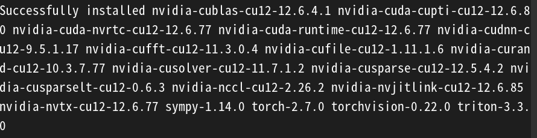

# 我的开发环境配置

我有两台机器，一台是只有核显的轻薄本，另一台是有独显的游戏本。因此编写代码在两台机器上都可以，但是模型的训练只能在游戏本上进行。通过`nvidia-smi`命令可以得到其显卡配置，如下图，是显存为8G的4060，能够满足实验需要。  


我计划在碎片时间用轻薄本撰写初步的代码，在游戏本进行代码debug与程序调试，两台机器的进度通过**git**的push与pull来统一，尽可能每日更新进度。  

# 一阶段：基本代码阅读与补全

## 程序入口

一边运行程序、一边阅读代码是高效的，所以需要先让程序能够跑起来，而在这过程中会有许多环境依赖的问题，以及程序入口有些路径都需要逐项配置、修改。  

### 程序入口：mars.py  

根据README中的提示，程序入口位于*mars.py*文件。  
运行之前需要在指定路径（./cfgops）中存放一个文件，应以*c1.py*为模板。  

### 模型设置：c1.py  

其内部定义了一个名为*mcfg*的函数，接受一个名为tags的参数，根据后面可以推测这是一个字符串列表，后面会根据其内的字符串来匹配不同的模式。  
此外，还有一个数据建立的部分，应该是定义数据集路径。  

### 运行

维持*c1.py*中的配置，先运行看看，第一次提示缺少*torchvision*、*cv2*等包，用pip安装即可，可见在之前安装的torch包之外又追加了一系列新依赖。  

  

> 搜索可知，pytorch生态中，torch包是主库，基本功能由其实现  
> 而torchvision包是特地为计算机视觉任务提供的附加库，提供了CV方向的额外功能  

再次运行，这次的报错是因为*mars.py*中默认给定的root存放路径没有修改，指向了一个不存在的系统根目录，所以会报错。  
着手对其进行修改，将其变为一个指定的本地目录。注意到其注释提示“*注意项目运行root不要放在代码路径下*”，没能理解，搜索结果如下。  

> 在模型运行时，会产生大量临时文件、缓存、模型输出  
> 如果将运行根目录root放在当前代码路径下（即我这里的Mars_Assignment），会使源代码与模型混在一起，一方面会占用大量空间，另一方面不符合程序设计的哲学  

所以需要在当前目录外创建一个运行文件夹来存放这些中间数据以及下载的数据集。  
我这里是另外创建*Mars_Assignment_Running*文件夹，将其路径设为root。  

然后再次运行，这次的报错依然是路径错误，一路溯源，就在于*c1.py*内部的数据集建立部分没有对应更改。将其按照结构与下载的数据集对应上即可，***但是发现下载来的数据集结构与给出的并不一样***，今天先到此结束。  

**5.7日**  
***

重新阅读实验手册，发现数据集在“*数据/项目初始代码下载*”部分已经给定链接，而不是到数据集作者官网下载原版没有分割的数据集。  
下载后，在*c1.py*文件内将数据集路径一一对应进行修改，无误后运行。  

终于，这次报错信息变为了**NotImplementedError: Backbone::__init__
**，说明函数入口的一些配置已经完成，成功进入程序，走到了需要补全的地方，接下来开始对代码进行补全。  

## 代码补全

### Backbone

根据报错信息
```
File"/home/liuzt/Documents/MD_learning/PR&ML_Assignment/Mars/Mars_Assignment/model/base/backbone.py", line 14, in __init__raise  
NotImplementedError("Backbone::__init__")
```
可知现在进入了**yolo**网络的Backbone层。在整体结构图上，这一部分的具体操作在左侧这一例，从原图出发，经过不同的卷积层，最后得到四个*feat*。  

观察*backbone.py*代码，经查询，这是一个典型的pytorch构建自定义神经网络方式：  
> class Backbone(nn.Module) 这里是定义了一个新类，继承自神经网络的基类
> 因此只需要实现\_\_init\_\_函数来初始化、forward函数来定义前向传播逻辑即可

