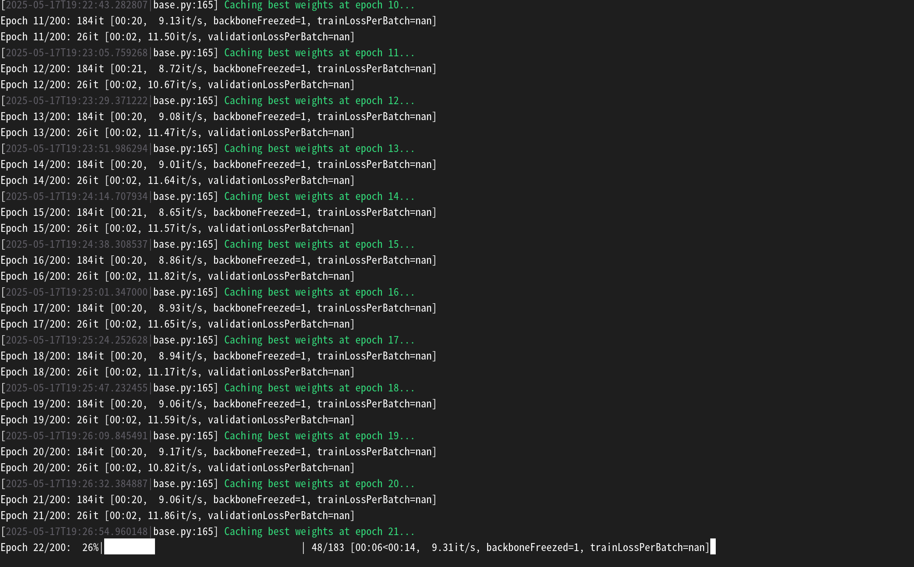

# 我的开发环境配置

我有两台机器，一台是只有核显的轻薄本（称为x1c），另一台是有独显的游戏本（称为u-deb）。因此在两台机器上都可以编写代码，但是模型的训练只能在u-deb上进行。通过`nvidia-smi`命令可以得到其显卡配置，如下图，是显存为8G的4060，能够满足实验需要。  


我计划在碎片时间用x1c撰写初步的代码，在u-deb进行代码debug与程序调试，两台机器的进度通过**git**的push与pull来统一，尽可能每日更新进度。  

# 一阶段：基本代码阅读与补全

## 程序入口

一边运行程序、一边阅读代码是高效的，所以需要先让程序能够跑起来，而在这过程中会有许多环境依赖的问题，以及程序入口有些路径都需要逐项配置、修改。  

### 程序入口：mars.py  

根据README中的提示，程序入口位于*mars.py*文件。  
运行之前需要在指定路径（./cfgops）中存放一个文件，应以*c1.py*为模板。  

### 模型设置：c1.py  

其内部定义了一个名为*mcfg*的函数，接受一个名为tags的参数，根据后面可以推测这是一个字符串列表，后面会根据其内的字符串来匹配不同的模式。  
此外，还有一个数据建立的部分，应该是定义数据集路径。  

### 运行

维持*c1.py*中的配置，先运行看看，第一次提示缺少*torchvision*、*cv2*等包，用pip安装即可，可见在之前安装的torch包之外又追加了一系列新依赖。  

  

> 搜索可知，pytorch生态中，torch包是主库，基本功能由其实现  
> 而torchvision包是特地为计算机视觉任务提供的附加库，提供了CV方向的额外功能  

再次运行，这次的报错是因为*mars.py*中默认给定的root存放路径没有修改，指向了一个不存在的系统根目录，所以会报错。  
着手对其进行修改，将其变为一个指定的本地目录。注意到其注释提示“*注意项目运行root不要放在代码路径下*”，没能理解，搜索结果如下。  

> 在模型运行时，会产生大量临时文件、缓存、模型输出  
> 如果将运行根目录root放在当前代码路径下（即我这里的Mars_Assignment），会使源代码与模型混在一起，一方面会占用大量空间，另一方面不符合程序设计的哲学  

所以需要在当前目录外创建一个运行文件夹来存放这些中间数据以及下载的数据集。  
我这里是另外创建*Mars_Assignment_Running*文件夹，将其路径设为root。  

然后再次运行，这次的报错依然是路径错误，一路溯源，就在于*c1.py*内部的数据集建立部分没有对应更改。将其按照结构与下载的数据集对应上即可，***但是发现下载来的数据集结构与给出的并不一样***，今天先到此结束。  

**5.7日**  
***

重新阅读实验手册，发现数据集在“*数据/项目初始代码下载*”部分已经给定链接，而不是到数据集作者官网下载原版没有分割的数据集。  
下载后，在*c1.py*文件内将数据集路径一一对应进行修改，无误后运行。  

终于，这次报错信息变为了**NotImplementedError: Backbone::__init__
**，说明函数入口的一些配置已经完成，成功进入程序，走到了需要补全的地方，接下来开始对代码进行补全。  

## 代码补全

### Backbone

根据报错信息
```
File"/home/liuzt/Documents/MD_learning/PR&ML_Assignment/Mars/Mars_Assignment/model/base/backbone.py", line 14, in __init__raise  
NotImplementedError("Backbone::__init__")
```
可知现在进入了**yolo**网络的Backbone层。在整体结构图上，这一部分的具体操作在左侧这一例，从原图像出发，经过不同的卷积层，最后得到四个*feat*。  

观察*backbone.py*代码，经查询，这是一个典型的pytorch构建自定义神经网络方式：  
> class Backbone(nn.Module) 这里是定义了一个新类，继承自神经网络的基类
> 因此只需要实现\_\_init\_\_函数来初始化、forward函数来定义前向传播逻辑即可

由于继承的*nn.Module*，可以方便的在自定义类中调用各种神经网络层、张量操作等。  

#### 基本单元：ConvModule

在结构图中可以看到，最基本的单元就是*ConvModule*卷积层模块，其组成是**Conv2d二维卷积 + BatchNorm2d归一化 + SiLU激活**。卷积与归一化都了解，但是SiLU激活函数并没有了解过，遂搜索。  
> 搜索发现，SiLU函数是"x*sigmoid(x)"，用于提高模型非线性表达能力。  
> 函数式为 x/(1+e^-x)  

了解这三样基本组成单元后就可以构建，三者都可以通过nn.来调用，然后经搜索，可以用nn.Sequential方法将几层聚合成为一个，调用时按照函数来用就行。如此，就可以再将ConvModule打包成一个函数来直接调用。  

#### CSPLayer_2Conv

是十分复杂的一个单元。  
输入很简单，就是一个布尔量add以及一个求和数n，只是内部复杂。  

在进入后，首先经过一个ConvModule，然后**就不太明白**：输出的应该只有一个c_out维，但是图上还另外分了0.5c_out给concat，以及一整个c_out维给split。  
搜索的结果说是只有一个出口，进入split，可是图中明明是两个。所以这里今天没能搞懂。  

继续往下，先用pass完成需要完成的函数占空，然后整体先构建起来。发现不知道“n=3*d”中d参数如何获取，也是一个问题。今天先这样结束。  

**5.8**  
***

关于昨天的第一个问题，查找资料得到yolov8的这张结构图有两种，原理一致，只是手册里这版的Neck和Head层在另一版里合成了一层。  

分析两图结构相同之处以及要表达的意义，再结合最后一层输入的形状0.5(n+2)cout，可以猜测手册里的这一版应该是代表将第一层输入完整的送到concat，只是表达的方式不好。  
这样就能够匹配上最后的形状，同时在意义上也实现了最后与原数据的concat。  

#### SPPF

这一层的detial中没有给定输出维度，在架构图中分析，发现其输入输出是同维的，所以根据输入给定输出即可。  

detial中的MaxPool2d层没有给定任何参数，但是查询nn.MaxPool2d的用法时发现其是需要参数的：  
> kernel_size: 池化窗口大小  
> stride: 步长（默认等于 kernel_size） 
> padding: 边缘补零  

由于可能是自定义，也可能是一个约定俗成的大小，继续搜索这一模块在yolov8中的特定用法，果然是在SPPF层的特定用法，具体参数是固定的，分别是kernel_size=5, stride=1, padding=2。  

这样写的意义要从SPPF这一层的作用说起。SPPF是“SPP Fast”的缩写，意思是“快速感受野拓展”，比SPP更轻量、快速，通过多个MaxPool池化级联、最后再和原始输入拼接来增加感受野与提取上下文信息。  
而参数设置成5,1,2的关键就在于可以保持输入与输出同维，使MaxPool可以在多层级联中复用。  

依然将其封装为可调用的函数。  

#### 返回结构

基本构建好forward函数，但是返回值的结构并不很清晰，是作为列表、字典或者元组？  
到时候到调用的地方查看一下即可，现在先空着。  

#### 调试验证

根据结构图编写完**Backbone**部分，接下来是用调试方法检验正确性。  
由于之前使用过gdb，所以对于pdb的操作有一定的接受性，根据教程在forward函数开头下断点，运行时却直接报了**Neck**部分的未编译错误。可能是因为要先将所有模块初始化后才会执行，将断点设在init函数开头，再次执行，发现的确在**Backbone**对象的初始化完毕后继续初始化Neck部分。所以只好先继续完成其余模块。  

其实这里也看出来心急之处，明明报错信息是init函数未编译，但是却将forward部分也一并补全了，最后还一时半会debug不了:(。  

此外，在这里利用调试还可以解决之前的另一个问题，也就是CSPLayer层的输入中，关于层数，其与模型参数d是有关的，但是给定的初始参数中没用过的只有n，而不是d。其实这里也就可以大胆判定n就是3xd，在调试模式用`p n`来查看n的值，为1。这的确是3xd。所以照此补全即可。  
（在后面看到*yolomodel.py*文件时，其注释也提到了“*note that n = 3 x d*”，所以考究的结果是正确的。）  

### Neck

紧接着是Neck部分代码的编写。  
虽然前面提到了心急，直接一整个模块编完，但是其实一整个编完也没有什么问题。  

5.11先到这里
***

#### Upsample

发现Neck部分有两个上采样模块，并且作用都是让长、宽的分辨率增加一倍。  
查询nn中的上采样方法，有两种：  
> 一种是作为模块使用的nn.Upsample，就像Conv2d一样  
> 另一种是作为函数式使用的nn.functional.interpolate，更灵活  

因此沿袭上面的思路，还是要定义成一个个函数来使用更好，所以使用第二种来包装成函数。  

#### 模块函数复用

之前的模块都定义在**backbone.py**中，在这里依然要复用其中的函数。  
使用`from xxx import xxx`，在后面会发现提示模块未找到，经查，发现这是因为python的包结构的问题，需要使用相对路径。由于已经有init模块，用相对路径即可。  

#### 输出格式

注释中的C、X、Y、Z在原理图中并没有明确的指出是哪几个，发现原图中只向**Head**模块输出了三个，可能是X、Y、Z？  
再分析detial，有四个有名字的节点，是TopdowmLayer的1与2，以及BottomupLayer的0与1，对应一下形状，发现的确可以。  
也就是说，C->TopdowmLayer2，X->TopdownLayer1，Y->BottomupLayer0，Z->BottomupLayer1。  

由于依然没有运行到这里，所以具体的形式和Backbone一样依然未知。  

#### 运行

这次没有报后面编译error，反而是日志提示新模型被创建后，报了一个“*ValueError: Image file in subset not exists: /Mars_Assignment_Running/mar20/images/2490.jpg*”的值错误。  

可是数据集中明明有2490的，也许是dl(dataloader)模块有问题，在出错误模块开头添加断点，进行pdb调试。  

盯了一会，发现是低级错误，在**c1.py**中的*imageDir*定义时写成了绝对路径，所以在根目录找，肯定找不到。同样的，下一行的注释路径也写成了绝对路径，低级错误。  

终于，再次运行，提示"*NotImplementedError: YoloModel::freezeBackbone*"，这是一个定义在**yolomodel.py**中的自定义错误，提示freezeBackbone模块没有完成。  

### freezeBackbone

通过调试功能，定位freezeBackbone，发现其是在**base.py**中的preEpochSetup函数中被使用的，并且是一对，分别是*freezeBackbone*和*unfreezeBackbone*，同时分配有一个布尔标志位：self.backboneFreezed，在freeze时为True，在unfreeze时为False。  

以上是从代码结构进行的分析，但是preEpochSetup有什么用，是“提前批量数据建立”吗？freezeBackbone是暂时停止Backbone层的操作吗，如果是的话又为什么这么做？  
这些问题在结构图中并没有过说明，需要自己去搜寻。  

直接搜索preEpochSetup，可知其是一个社区的常用命名，一般用法如下：  
> 更新学习率；重置统计数据；打乱数据集；打印日志；清空GPU缓存等  

浏览preEpochSetup的代码，以及实时调试，其似乎实现了一个输入模型与要用到的一批数据，然后对数据内符合freezeBackbone标准的数据进行匹配，修改模型的freezeBackbone有关。这样看还是云里雾里，不明白这是什么意思。  

搜索freezeBackbone，得到其作用：  
> 用于冻结模型主干（backbone）参数的方法，这样在训练过程中，主干部分的权重不会更新，只训练其他部分（比如检测头）。这通常用于迁移学习，当希望利用预训练特征提取器时非常有用。  
> 在 YOLOv8 中的作用是当主干网络（比如 CSPDarknet）已经在大数据集（如 COCO）上预训练好了，如果想用用自己的小数据集做 fine-tuning，冻结主干可以减少训练时间、减少过拟合、保持特征提取能力
	> fine-tuning是指微调，是在已有模型的基础上进行少量训练以适应新需求的策略   

可见freezeBackbone的作用更多的是利于后面的小样本增量学习、知识蒸馏的应用。  

整合以上的信息，可以知道freeze与unfreeze的内部规律。  

5.12
***

freezeBackbone会令模型主干层中的超参数停止更新，相应的，unfreezeBackbone会恢复，具体的应用是配合freezeBackboneEpoch这一概念，在大量数据预训练得到的初始模型下，用小的数据集进行微调、改变相关超参数时会产生“灾难性遗忘”，忘记之前在大数据下的表现，并对小数据集过拟合。  
所以需要设置在小批量数据训练开始前先冻结主干，只修改其他部分的参数，等到梯度稳定、模型适应后，在后续训练批次才允许修改，即unfreezeBackbone。这样也能提高训练速度。  

更具体的，避免某一模块的超参数更新，可以先遍历该模块的所有层，将其设为`requires_grad = False`来使其不接受梯度反向传播，达到不更新数据，“freeze”的效果。  

5.13
***

但是"requires_grad"的值想要被修改，该变量必须要能被.parameter方法注册为类成员。  
也就是说我的这些模块需要定义在Backbone的init中，需要将他们模块化。而目前的方式是函数式，所以要想实现，还需要重构。  
> 当前的函数式有两个问题：
	> 第一是运行时构造并立即执行模块，导致无法在 init()中提前注册模块，也就不能使用 .parameters() 或 .to(device) 等 PyTorch 机制；  
	> 另外是为了方便，函数实现与输入紧绑定，也就是建立在输入张量已知的情况下，所以也没有办法在init中先建立。这涉及到一个核心思想：模块设计必须与数据无关（即不要依赖运行时的输入数据 shape）  

在重构中，函数转为模块，依然是继承nn.Module建立一个新类，然后建立初始化与前向传播函数，按照原有逻辑重新写一写即可，这样封装成一个个模块，被注册后就能用`self.backbone.requires_grad = False`冻结。  

重构完成后，同样地在**neck.py**中也对应的修改。  

debug：  
+ 初始化对父类时要用`super().__init__()`而不是`super.__init()`，细节问题  
+ 在初始化时，“nn.Conv2d(c_in, c_out, k, stride=s, padding=p)”报错，显示TypeError。搜索一番，意思是我输入的不是整数，有浮点数，不接受。于是通过pdb在这里打断点，然后依次打印，发现是*c_out*为浮点，是16.0。将其转换为int即可。  
+ 同样的，下一个nn.BatchNorm2d(c_out)也是同样的错误，所以干脆在开头就将其变为int类型。  
+ 同样地，后面c_in也会出问题，所以也一样转为int  

#### 重构后运行

这次十分顺利，到达了之前空着不知道返回值如何打包的地方。  
观察报错信息为“_, feat1, feat2, feat3 = self.backbone.forward(x)  
TypeError: cannot unpack non-iterable NoneType object
”  

也就是说要接收的是四个，直接四个一起返回即可，不用什么包装  
> python默认支持多返回值，会打包成为一个元组  

补全backbone与neck的输出后，继续运行，这次是自己实现的Upsample：“return nn.interpolate(x, scale_factor=2, mode='bilinear', align_corners=False)  
AttributeError: module 'torch.nn' has no attribute 'interpolate'”  

查找可得，也是因为细节问题：应用`nn.functional.interpolate`而不是`nn.interpolate`，修改细节即可。  

### Debug例子

喜闻乐见的debug时间。  
报错信息为“RuntimeError: Given groups=1, weight of size [128, 384, 1, 1], expected input[16, 1152, 40, 40] to have 384 channels, but got 1152 channels  instead”  

说明是有一个地方ConvModule输入不对劲。先在ConvModule的forward中设置断点，一直continue，果然后续也出现了这个问题。但是由于基本每个模块都会调用，不好定位，很容易跟丢。  

所以采取另一种方式，也就是用print，在每一层的前向传播时打印预期输入与实际输入，这样在哪里出错就可以分析出来，于是在ConvModule实现：  
  

但是依然有些太多了，既然Conv是一个基础模块，那么在高级模块打印呢？于是在CSPLayer中进行这个操作，再次输出：  
  
这次就十分清晰了，在第五个CSPLayer不一致，是在neck部分的TopDownlayer2。  

于是在此处设置断点，分析实际输入：  
  
比理论大了三倍，那么是backbone的输出有问题。

将断点移到backbone处，发现问题出在最后一层：  
  
理论形状为256，但是实际上是1024，出了问题。处问题的是SPPF模块，对照，发现是漏了一个模块。粗心！  

补全后继续运行，看到了令人安心的“NotImplementedError: DetectionLoss::\_\_call\_\_”  

5.14的工作到此结束～  
***

### DetectionLoss

错误信息是在**loss.py**中的Detection类的\_\_call\_\_函数，首先研究一下它是什么用：  
> \_\_call\_\_ 的作用就是让一个类的实例表现得像一个函数，适用于需要状态和行为结合的场景。
> 具体的，其会让更简洁，比如建立了一个module，如果用类来完成forward，会写的繁琐，而用这个特性直接用类调用  

然后再分析这个类是用来做什么的。搜索得：  
> DetectionLoss 是 YOLOv8 中的损失函数类，负责在训练时根据模型输出和真实标注计算总损失。  

整个过程是  
1. 先初始化三个损失项，分别是边框box损失、分类cls损失、分布式回归DFL损失  
> box损失：衡量模型预测的边界框位置与真实框之间的差异，通常用一种IoU Loss的方式  
> cls损失：衡量模型预测的目标类别与真实类别是否一致，用于惩罚预测错误的概率分布  
> DFL损失：YOLOv8 使用了分布式回归（DFL）来预测边界框，不再直接预测数值，而是预测某个离散分布，DFL 就是衡量这个分布与真实数值的差异，是一个改进  
2. 预测预处理，最终得到的predBoxDistribution是所有预测点的回归分布（用于计算 box）；得到的predClassScores是所有预测点的类别分布（用于计算分类损失）  
3. 标签预处理，将原始标签转换成训练所需格式  
4. 损失计算部分，这里需要补全  
5. 最后再对三类损失加权求和，得到最终总损失  

损失计算部分有点困难，代码好复杂。。。  
首先根据结构，可以分析出这里肯定是写成`loss[n] = self.xxxx(xxxx)`这样的利用内置方法来完成上述几种损失的获取。  

loss[0]就是box损失，发现上面有BboxLoss模块可以利用，在init中也定义的有，所以用它的forward应该能计算出。再看forward的内部，不光计算了代表box的iou损失，还利用DFL模块计算了代表DFL的损失，最后输出两项损失。所以可以按这个格式完成两个损失。  

但是forward有好多复杂且看不懂的参数，借助翻译与AI工具进行分析：  
+ pre_dist：是每个预测点输出的每个边界（左、上、右、下）对应的分布，这个会在DFL损失使用。应该就是有三个的preds，并以为这也是一一对应的，索引为二。可是发现preds的三个并不是与损失对应的，而是三个尺度方面的特征图，所以可以先整个放进去。  
+ pred_bboxes：这个是解码后的真实图片框坐标，具体是因为预测坐标是基于**锚点**的相对偏移量（锚点+box分布=真实图片框），要想获得真实图像上的框坐标就还要进行一个解码，得到的会用来计算IoU损失。根据搜索得到的张量形状与上述分析，猜测可能是预处理部分得到的gtBboxes.  
+ anchor_points：这个是锚点，也就是有了这个才能解码。但是并没有找到显式的锚点
+ target_bboxes：每个预测点分配到的 GT 框，在 assigner 中分配的，这里应该是用TaskAlignedAssigner模块来获取。再次研究**tal.py**中的这个模块，仍然是最终都集中到forward里，然后输出四个值，似乎都挺有用，可以先跑一下。这个的输入就很明显，用已有的。其中锚点不知道用什么。
+ target_scores：是每个预测点的标签分布，在 bbox loss 中用于加权。上一步得到了。
+ target_scores_sum：其实是target_scores.sum()，用于归一化所有loss。
+ fg_mask：标记哪些哪些预测点是前景（参与 loss），也得到了。  

现在的情况是锚点未知、前几个参数不确定。  

#### 锚点

查找锚点，发现一般会存储在self.model.anchor_points这样的变量中，但具体是未知的，所以debug一下，看有没有这用法。  

  

发现是有的！所以可以补全了。  

5.15  
***

尽管还不确定，但是至少损失0和2的框架已经搭建好了。现在还剩cls损失，于是继续搜索：  
> 分类损失 loss[1]通常是 BCEWithLogitsLoss 或 Focal Loss，并且要结合 assigner（TaskAlignedAssigner）来筛选正负样本。  

刚好是不知道有什么用的BCEWithLogitsLoss模块，看来其就是用来算cls损失的。但是转到其定义，由于这是torch.nn的官方库，写的十分复杂且多，并不是很能看懂，所以直接搜索用法：  
> BCEWithLogitsLoss 是 PyTorch 中一个常用的 二分类交叉熵损失函数，它比单独使用 Sigmoid + BCELoss 更高效、数值更稳定
> yolov8中，loss_cls = self.bce(pred_class_scores, target_scores)
	> pred_class_scores 是预测的 logits（每个位置对每个类别的得分）
	> target_scores 是 one-hot 编码的目标标签（0 或 1）
	> reduction="none" 表示我们之后会自己加权或 mask 处理

所以这里就明白如何写了，按照给定的格式补全。  

#### 借助大模型确定是否正确以及详细分析

将自己完成的部分输入给大模型，让其检查是否正确：  
> 问题 1：bboxLoss.forward() 里的第一个参数错误
> 问题 2：anchor_points 是多尺度拼接后的
> 问题 3：分类损失（loss[1]）不该直接 BCE

挨个分析分析，不会的就追问到底。  

##### 问题1以及其他参数

第一个错误是说参数“preds”，这里我用的是原始的preds，代表了不同的特征图层，但是没有经过处理，这里其实更要用predBoxDistribution。  
> preds是不同特征图层作为列表的集合，是未经过处理的
> predBoxDistribution是preds多层拼接后再按通道分割的结果，是经过处理的，代表每个 anchor 的 box 回归分布  

现在再回看上面搜索得到的“pre_dist：是每个预测点输出的每个边界（左、上、右、下）对应的分布”，的确是应该用用predBoxDistribution的。  

同时，第二个参数也不正确。现在填的gtBox在前面补充的TaskAlignedAssigner有用，所以这里是其他的。再次分析参数“pred_bboxes：这个是解码后的框坐标”，这里的应该是用某种解码方法或函数处理后得到的，一般都命名为decode类似的函数。  
发现文件开头引用部分有一个bboxDecode导入了但没有使用，可能就是在这里有用。  

分析其输入：bboxDecode(anchor_points, pred_dist, proj, xywh)，前两个是解码所需的锚点坐标与预测分布，这个是已知的；后两个则并没有见过，继续搜索：  
> proj：投影张量，用于将分布映射为距离值
> xywh：是否输出 xywh 格式（中心点+宽高）

显然proj代表的投影张量在前面给出的代码中并没有实现，应该是需要自己实现的。  
proj并没有太多解释，这是一个形如 [0, 1, 2, ..., reg_max - 1] 的张量，用于参与将预测的每一维分布映射成一个距离值（例如左边界距离）。  
用法很简单直接，就是生成一串简单的线性序列，主要用处是将离散分布转化为连续数值  
> 前面知道，yolov8预测的不是 bbox 位置的具体数值，而是每个边界的一个离散概率分布
> 在这里我们希望把这个概率分布变成一个连续的期望位置
> 可以把proj 理解为 DFL 的“坐标刻度尺”，本身没信息，但参与了计算的“映射”

而xywh就是一个布尔类型，实际上我们不需要xywh格式的输出，令其为False即可。  

##### 问题2

其实是要确定anchor_points是拼接好的所有层的 anchor_points，需要确定形状，需要到**yolomodel.py**中分析一下self.anchorPoints的生成。  

发现这里的锚点生成十分规范，没有什么问题。可以直接用；  
另外也发现在model中也定义了proj，所以上面自定义是不用了，直接调用self.model.proj  

##### 问题3

分析得到这里的问题有两点。  
第一点是`loss[1] = self.bce(predClassScores, target_scores)`由于其内部实现有一个`reduction="none"`标签，导致结果并未求和，所以得到的是原始张量，而损失需要是张量。  

第二点是这里要做一下归一化。这里又对锚点、前景等加深了理解。  
首先为锚点和前景再加深自己的印象，一张图片上可以定义诸多锚点，可以理解成图片上有许多均匀横线与竖线，锚点就是他们的交点。而在做目标检测时，是分为前景与背景的，前景就是识别出的物体，而剩下的就是背景。  

由于图片上有许多锚点，所以可以通过锚点来识别前景的分布，尤其是yolov8是分析概率分布，因此最后可以将锚点分为前景锚点与背景锚点。  

在计算cls损失时，首先通过bce会得到作为张量的cls损失  
> 因为在获取target_score时，如果是前景，那么是一个[0, 0, 1, ...]这样的，有一个预测类别，而对于背景，score就是一个全0
> 在进行bce损失计算，会返回每一个样本（锚点）、每一类别的损失，保留了逐点信息

在计算损失时，都是基于一个样本的，因此先求和，将一个锚点所有类别的损失压缩到一个锚点的损失上，现在这个损失是所有锚点各自的损失。  

接下来需要针对前景锚点进行损失计算，因此要用掩码fg_mask来筛选出前景锚点来统一计算。  
+ PS：为什么不用背景锚点？因为背景锚点的真正意义是其不包含任何类别，不需要学习，而其target_score为全0，尽管是为了便于统一表示，但是其也代表了“不属于任何类别”，倘若将背景加入学习，反倒会损失性能，在之后有类别时也会抑制。  
+ 另：其实这里的掩码加不加都无所谓，因为大模型给了两种写法，追问之下，解释是，在背景锚点所有分类target_score为0时，“*背景的损失被加到了分子，但没有被平均进分母，因此它不会参与归一化，相当于没有权重。最终的训练过程只强化前景类别的预测，对背景没有直接优化压力。*”这里我并不是很能看得懂，但是至少加上掩码的能明白，并且掩码对于任意target_score的逻辑下都可用。  

筛选出需要学习的前景锚点后，为了符合loss[1]，因此需要将其求和，变为一个标量。  
可以预见这个标量并不稳定，因为如果一张图前景锚点多的话，结果就大，少时结果就小，哪怕其锚点的损失都差不多。因此需要进行归一化。  

很显然的，归一化除以前景锚点总数即可，因为我们这里只用到了前景锚点。  
但是由于刚开始时看的是没有掩码过的，所以对于这个还有一个解释：在计算时用到了所有锚点，但是实际上有贡献的是前景锚点，由于前景锚点占总锚点数量少，如果除以总锚点数，会直接将前景稀释，所以选择只除以前景锚点的数量来归一化。  

在按照以上写代码时，有一点是不知道的：fg_mask.sum().clamp(min=1)，clamp(min=1)的作用是避免图片完全没有匹配上时发生除零错误。  

#### 再一次debug

继续运行，这里有一个报错，提示 “overlaps[mask_gt] = self.iou_calculation(gt_boxes, pd_boxes)  
RuntimeError: shape mismatch: value tensor of shape [512, 16] cannot be broadcast to indexing result of shape [512]”  
维度不匹配。  

问大模型，连番追问到底是输入的问题还是函数的问题，其信誓旦旦的说输入没有问题，是这几个内部函数的预期假设什么的有错，让我改内部逻辑。但是我并不认为给的这些内置函数会错。  

到forward的注释中看，“mask_gt (Tensor): shape(bs, n_max_boxes, 1)”
，也就是预期最后一维是1，但是在pdb中看，“p mask_gt.shape
torch.Size([16, 12, 8400])
”，所以是因为输入不符合预期。所以大模型不可轻信！  

所以问题是出在gtMask上。指出问题后，让大模型再分析：  
> 现有的变量gtMask是一个掩码，筛选出哪些锚点落在了哪个GT内  
> 函数的预期输入mask_gt是代表哪些GT是真实的，也就是区分有效框
>> 关于gt，就是“Ground Truth”的缩写，中文一般叫做“真实标签”，在训练时为了方便预处理，会给样本设定一个最大GT框数，而真实样本不一定有那么多，多余的会用空框表示

所以是不对的，这是一个输入语义误解导致的形状错误，应该使用`mask_gt = gt_bboxes.sum(-1, keepdim=True).gt(0)`来获取真实掩码  
> 这个写法又为什么能得到有效GT？  
> 首先sum会对每一个框的几个坐标求和，每个框对应一个值，然后用gt(0)来与0比较，看是否大于0。
> 无效框四点是0，所以和是0，而有效框必然不是，所以有效是True，无效是False.  

但是一看，这不正是给定的写法吗。又被带到沟里了。  

又经过一番无用的追问，最后又是自己在源代码中看到了一丝端倪：  
+ pd_boxes的形状应该是(b, max_num_obj, 1, 4)，gt_boxes应该是(b, 1, h*w, 4)  
+ 但是pdb打印形状，gt_boxes.shape是torch.Size([512, 4])
，pd_boxes.shape是torch.Size([512, 64])，而期望的最后一维都是4，所以可以确定是pd_boxes出问题了。  

今天先到这里，最后，记录一下令人困惑的box与bbox：  
> 实际上两个都是一个东西，但是一般用bbox来特指图片上真实包围框。  

5.16  
***

回顾一下错误，是在iou输出的赋值对应不上，然后研究左值没问题，那么是右值不对；  
右值是一个函数调用，函数实现是给定的，应该不会错，那么就只可能是自己给的函数参数不对；  
于是阅读代码，发现两个参数都有预设好的shape，用pdb比对，发现是pd_bboxes的维度不对，所以错误是在设置参数时就产生的。  

定位错误后，再回顾一下pd_bboxes参数：  
> pred_bboxes：这个是解码后的真实图片框坐标  

就是这个解码后！立刻想起来self.bboxLoss.forward中也有，用的是解码后的，而这里也应该是。  

修改一下函数写法，拥有一个统一的pd_bboxes传入，再次运行，终于有了正常的训练进度条！！！  
  
终于是开启了训练过程。  

### 疑惑

由于我在完成代码的思路上是一边写一边运行，直到遇见下一个错误，要么继续补全，要么继续debug。  
所以当时照着整个yolo架构图搭建是明明只完成了**backbone**与**neck**，而后面的**head**我还并没有完成过。但是就这样训练起来了，莫非是head是和前面两个解耦的？这也不太可能。  
为了一探究竟，转到**head.py**，原来这里是已经为我完成了……  

## 训练中（止）

上面那张图片是因为没有全屏。现在先放一张正常的训练图片：  
  

正想分析一下都代表什么意思，结果一分析，这个日志代表出事了：  
每两个训练进度条与下一个时间戳是一组，第一行是表示已经在整个数据集上跑了多少遍，第二行表示在验证集上的损失表现，然后记录下最好的超参数权重。  

但是这里出现了nan，这说明训练中出现了严重的错误，需要立刻停止训练。然后排查哪里出了错。  

查询，可以利用`if torch.isnan(loss).any():  
    print("Warning: NaN detected in loss!")
    exit(1)`  

这种写法来捕捉出现nan的损失。    

5.17  
***

运行后，却发现第一次计算损失就出现了NaN，说明问题还不小，并非是因为其他参数的设立不合理导致梯度崩溃，而是计算角度上一开始就出了问题。  

在出错时，由于总损失是由三种损失加权之和，所以有可能是其中一种出了错，导致整个错误。所以调试打印三种loss：  
  
结果十分不好，三种都是含有NaN，说明问题更广泛，难道是`self.assigner.forward`这里就错了。  

那么则在这个函数内部进行逐个形状比对来确定正确性。  
输入部分的形状：  
  
与注释中的预期形状对比，是正确无误的。  

输入部分的NaN：  
  
没有NaN。  

输出部分的形状：  
  
仍然的，与注释相较，也是一致的。  

那么既然形状无误，不妨再检查一下这里是否有出现NaN：  
  
发现**target_scores**这一张量全部是NaN，应该就是这里出了问题。  

继续深入，发现**targrt_score**在函数中出现三次，也就是值改变了三次，只要捕捉这三次中错误的一步。  
  
是其与**norm_align_metric**这一变量相乘后异常的，而**norm_align_metric**这一变量又本身全时NaN。  

继续追踪norm_align_metric又是怎样变成NaN的。  
与其有关的变量有四个：  
+ align_metric  
+ pos_overlaps
+ pos_align_metrics
+ self.eps  

打印其值：  
  
**align_metric**与**pos_align_metrics**是NaN，pos_align_metrics来自align_metric，其一方面是来自`mask_pos, align_metric, overlaps = self.get_pos_mask(`这一句，另一方面来自`align_metric *= mask_pos`的乘等于，打印发现mask_pos并非NaN，那么错误又再一次定位到了更前面的这个部分。  

问题现在在**get_pos_mask**部分，在这个函数内部调试，**align_metric**仍然存在NaN，其形状为“torch.Size([16, 12, 8400])”，而共有108个NaN。  
具体的问题又在**get_box_metrics**函数中，再打断点追溯。  

终于追溯到了错误的起点：  
**get_box_metrics**函数中有`align_metric = bbox_scores.pow(self.alpha) * overlaps.pow(self.beta)`，而错误就是在这里诞生。  
NaN情况：  
  
形状情况：  
  

形状是吻合的。所以这里写成一个简单的表示：***A = 根号(B)+根号(O)***（打印了这个情况下self.alpha为0.5），那么问题的根本就确定了，一定是B与O中出现了负数导致无法开根，进而变成NaN。  

这一点也可以在调试中确定：  
  
也就是**bbox_scores**的问题。  

与其有关的语句是：`bbox_scores = torch.zeros([self.bs, self.n_max_boxes, na], dtype=pd_scores.dtype, device=pd_scores.device)`，` bbox_scores[mask_gt] = pd_scores[ind[0], :, ind[1]][mask_gt]`  

这两句代码的作用：在目标分配 (assigner) 里的一步，将预测框（anchor）和 ground truth（真实框）进行匹配，然后获取得分。  
+ 首先初始化一个匹配得分矩阵，都初始化为0。  
+ 然后对齐batch与anchor的位置，然后用掩码选出真正的框的分数，赋值给bbox_scores。  

所以这一句并不是创造出了负数，而是将pd_scores中原本就存在的负数赋值给。  
可以通过`p pd_scores.min()`来确定是否真的含有负数，结果是“tensor(-6.9689)”。  

那么pd_scores中的负数又是从何而来呢，再追溯回去，发现其产生在**DetectionLoss**类中。  
具体的是**predClassScores**这个变量，结合大模型的回答，可以做出以下结论：  
+ predClassScores本身是是模型输出 logits。  
+ 由于BCE计算损失时要用到predClassScores，由于算法的原因，这个值应该是原始数据，即未经激活。  
+ 但是在其他地方要用到这个值时，必须得经过sigmoid激活，来投射为一个在0-1的分数。  

> **logits**是神经网络最后一层的输出，是一个“原始数据”，还没有经过激活
> 明明刚开始训练，为什么会有最后一层输出？**答**：模型刚开始训练，也存在有一个初始的神经网络超参数值，后续的训练就是在修改这些超参数，使其效果更好。  

**因此**，这里的这个bug终于发现了源头，就只是缺少一个sigmoid激活。  

补上sigmoid后，删掉断点，再次运行。  
但是本应出现的正常训练栏并未出现，而是再次提示NaN的出现。  

查看是哪一部分的损失还有问题：  
  
现在是loss[0]与loss[2]中还有问题，有一个NaN，而loss[1]已经正常了。  

loss[0]与loss[2]是同步赋值的，所以肯定是相关函数的问题。  

进入函数打断点，用与之前类似的方法，发现是这一句产生了NaN：`loss_iou = ((1.0 - iouv) * weight).sum() / target_scores_sum`  
NaN情况如下图：  
  

分析这里的处理，发现出错的地方就在于除以target_scores_sum时，由于初始化为全0，导致产生了**除零错误**引发的NaN。  

解决方法依稀记得有一个参数是很小的值，每次为分母加上，这样就能保证不为零。  
到大模型处询问，得到有两种方法：  
> 定义一个小常数，每次分母都加上它，适用于想让结果在极限情况下依然可导、连续，并尽可能接近实际值，不希望因为 0 而截断梯度或逻辑。
> 用clamp(min=1)强行转换，适用于期望完全跳过“无前景”的样本（例如 loss 不该发散），或想强行防止除零，哪怕失去一点精度也可以接受。  

结合这里是在计算iou损失，对精度的要求还是比较高的，所以使用第一种。  

## 真正的训练

修改完毕后再次开跑，终于，都回来了:)  
  

### 超参数/普通参数

训练时无事可做，看着不断刷新的数据，忽然有一个疑问：  
之前完成其他课程的作业时，也进行过“模型”的训练，数据集是基于CIFAR10的。当时是所有超参数各有一个列表，然后轮流组合，最后手动不断优化，最后获取最佳的超参数。  
那么现在这个大作业也是同样的道理吗？看着这有200个Epoch。  

询问了一下大模型，这个框架做的事和之前无异，只是由作业级别的“手动”变为了更“工业”的自动。核心思想与方法都是一样的。  

这其中有很重要的一点我要确认一下，就是我手动调参是先在一个大区间内先找到一个最优解，然后在这个最优解附近缩小区间，继续寻找，一直到合适的程度。那么这样自动化的过程，是机械的沿着给定的数据进行排列组合还是也有这么一个过程呢？  

查看一番，原来是我的错误理解，这二百轮训练实际上是在同一套超参数上训练的，每一轮更新实际上是在更新那些权重等参数。  
默认的超参数由**c1.py**实例化，原始超参数数据写在**mconfig.py**中。  

### 刚开始为什么冻结

看到前100个Epoch是将主干冻结的，直到后100个才解冻。  
所以刚开始为什么要冻结？之前是说冻结对小样本增量学习等有用，能先保留初始模型的关键数据，避免开始的杂乱数据被学习导致毁灭性遗忘，但这里明明刚开始训练。  

结果是：  
防止预训练权重被破坏（尤其在数据不足或数据初期质量较差时），但是我现在并未加载backbone的官方预训练权重，在这里作用不大  

### 失败结果

终于结束了漫长的训练，但是结果十分逆天：  
  

满屏的0宣告第一次训练的失败。  

分析一下。  

应该是因为模型在训练过程中没有收敛，并不是因为算法有错。  

原因可能是有冻结时间太长，一般只冻结几个或十几个。  
试着将100改为3，再进行训练，看看是否有改进。可以观察损失的变化趋势。  

5.19  
***

不止可以改冻结的数量，其他超参数也可以进行相应的更改。  

在这之前可以用一个小程序来绘制损失的变化趋势：  
  

训练损失下降缓慢，验证集损失不停振荡，可以先修改学习率进行优化、验证。同时只用30个批次也足够判断效果、收敛趋势等。  

但是这样修改后再跑，发现问题大了，训练完后所有评分都为纯0，查询，面对这种方式，有几个排错点：  
> 训练集和标签是否加载正确  
> 模型是否正确输出框

数据集与标签的加载肯定没有什么问题，绘制框可以通过一个有趣的参数，在mcfg中有一个“paintImages”参数，默认是False，但是将其改为True后，在训练结束后会用当前的模型进行标注，如下图：  
  

并且从**painter.py**中可以读到，紫色框是预先给定的正确框，而模型预测的框中，正确的（高质量框）会变为绿色，错误（低质量框）会变成黄色。  
那么这个模型的确是能输出框的，尽管都是不相关。  

从这个角度出发，又有几个思路：  
> decode 的 anchor 预测有误，导致宽和高有误  
> 一些阈值类参数设置不合理  

解码函数应该不会出错，所以或许是那些超参数不合理？将这些问大模型，果然有几个参数设置的不太合理：  
+ self.lossWeights = (7.5, 0.5, 1.5)，box loss 占了大头，可能导致模型只学到了对框位置优化，而分类部分学习不足，调整为(2.0, 1.0, 0.5)  
+ baseLearningRate = 1e-2,这个对于 SGD 来说偏大了点，尤其是在 batch size=16 的情况下，调整为0.0025	
+ minIou有点高，在训练阶段放低点，设为0.3

这样跑出来又有了一点效果，但是一看图是好多无意义的框：  
  

害怕这是瞎猫遇见死耗子，又问了一下，这似乎也算是正常，可以继续往下训练。  

5.20  
***